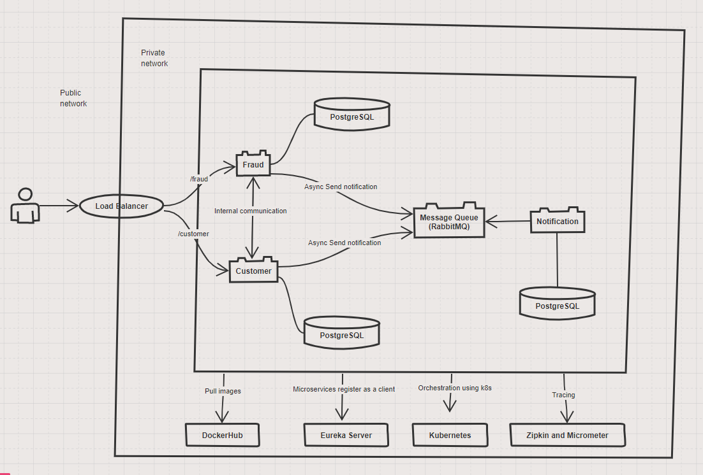

# Microservices

## Introduction

This project is a demonstration of a simple microservice project. The following is the architecture
of this project.


## Features

- The service uses RabbitMQ for messaging when a registration is placed and sends notifications to
  notification in real-time.
- The service uses Eureka for service discovery and API Gateway for routing different services. This
  part is commented as Kubernetes give us this possibility for free and managing one less service
  will be a help for maintaining the application.
- The service uses Micrometer and Zipkin for distributed tracing.
- All services are dockerized and deployed using Jib and Docker Compose
- Deployment and management using Kubernetes


## Deployment

This project uses Kubernetes for deploying and managing the microservices.
The Kubernetes configuration files for each service are included in the respective service
directories.
To deploy the services, you can use the provided Kubernetes YAML files and configure the cluster
accordingly.

### K8S

It is not advised to run database in a pod. You __SHOULD__ use managed databases in __PRODUCTION__
or any other environment. This is just for testing purposes.
To apply different configurations inside a folder, you should run:

```
kubectl apply -f <FOLDER-LOCATION>
```

To get more information about your pods, you can run ```kubectl get pods``` and to find out more
about a specific pod, you can run ```kubectl describe pod <POD-NAME>```. Logs are available
with ```kubectl logs <POD-NAME>```

To run commands in the postgres pod, you may
run ```kubectl exec -it <POD-NAME> -- psql -U <USERNAME-YOU-DEFINED>``` and run create database
commands.!
